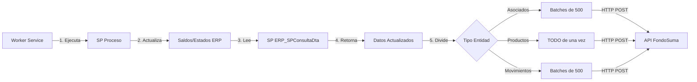

# ?? IntegradorOptimo v1.2

**Sincronización de alto rendimiento ERP ? FondoSuma**

[]()
[]()
[]()

Sistema empresarial que sincroniza **hasta 100K registros** de cooperativas financieras desde ERP a FondoSuma con **mínima sobrecarga** y **máxima velocidad**.

---

## ? Performance Demostrado

```
? Sincronización completa: 24 segundos
   • SP Proceso: 7s (actualizaciones ERP)
   • 8,500 Asociados: 5s (17 batches de 500)
   • 14,000 Productos: 4s (1 request de 14K) ??
   • 1,000 Movimientos: 3s (2 batches de 500)
   • 100 Tasas: <1s
   • Fecha Corte: <1s
```

**Throughput**: 3,500 registros/segundo (productos)

---

## ?? Características Principales

### ?? v1.2 - Optimizaciones Críticas

- **SP "Proceso" Automático** ?
  - Ejecutado antes de cada sincronización
  - Actualiza saldos, estados y cálculos del ERP
  - Garantiza datos 100% actualizados

- **Envío Completo de Productos** ??
  - 14K productos en 1 request HTTP (antes: 28 requests)
  - 50% más rápido que batches
  - SQL MERGE optimizado

- **Gestión Inteligente de Memoria**
  - Limpieza automática para datasets >100K
  - GC optimizado cada 50 batches
  - Soporta volúmenes masivos sin degradación

### ??? Arquitectura

- **Windows Service** (.NET 8)
- **Cron Scheduling** (NCrontab)
- **Circuit Breaker** (Polly)
- **Logging a Disco** (Serilog)
- **SQL MERGE** (Table-Valued Parameters)

---

## ?? Tecnologías

| Capa | Tecnología | Versión |
|------|------------|---------|
| Runtime | .NET | 8.0 |
| Base de Datos | SQL Server | 2016+ |
| HTTP Client | HttpClient + Polly | 8.2.0 |
| Logging | Serilog | 8.0.0 |
| Scheduling | NCrontab | 3.3.3 |
| Data Access | Dapper | 2.1.35 |

---

## ?? Instalación Rápida

### 1. Clonar el repositorio

```bash
git clone https://github.com/Estebanmg58/integradorOptimo.git
cd integradorOptimo
```

### 2. Configurar `appsettings.json`

```json
{
  "ConnectionStrings": {
    "ErpDatabase": "Server=SERVER;Database=ERP_DB;User Id=user;Password=pass;TrustServerCertificate=true;",
    "DestinationDatabase": "Server=SERVER;Database=IntegradorDB;User Id=user;Password=pass;TrustServerCertificate=true;"
  },
  "ApiSettings": {
    "BaseUrl": "https://api.fondosuma.com",
    "ApiKey": "LlaveAuthApiKey-!@#"
  },
  "IntegrationSettings": {
    "ExecuteProcesoBeforeSync": true  // ? CRÍTICO
  }
}
```

### 3. Publicar y ejecutar

```powershell
# Publicar
dotnet publish src/Integrador.Worker -c Release -o C:\IntegradorOptimo

# Instalar como servicio
sc.exe create IntegradorOptimo binPath="C:\IntegradorOptimo\Integrador.Worker.exe" start=auto

# Iniciar
sc.exe start IntegradorOptimo
```

### 4. Verificar logs

```powershell
Get-Content C:\Logs\IntegradorOptimo\log-*.txt -Tail 50 -Wait
```

**Documentación completa**: [INSTALLATION_GUIDE_V1.2.md](./INSTALLATION_GUIDE_V1.2.md)

---

## ?? Estructura del Proyecto

```
integradorOptimo/
?
??? src/
?   ??? Integrador.Core/              # DTOs y Models
?   ?   ??? DTOs/
?   ?   ?   ??? AsociadoDto.cs
?   ?   ?   ??? ProductoDto.cs
?   ?   ?   ??? MovimientoDto.cs
?   ?   ?   ??? TasaDto.cs
?   ?   ?   ??? FechaCorteDto.cs
?   ?   ??? Models/
?   ?       ??? IntegrationSettings.cs
?   ?
?   ??? Integrador.Infrastructure/    # Data Access
?   ?   ??? Repositories/
?   ?       ??? ErpRepository.cs      # Lee del ERP
?   ?       ??? IntegrationSettingsRepository.cs
?   ?
?   ??? Integrador.Worker/            # Windows Service
?       ??? IntegrationWorker.cs      # BackgroundService principal
?       ??? Services/
?       ?   ??? ApiClientService.cs   # Cliente HTTP con Polly
?       ?   ??? PollyPolicies.cs      # Retry + Circuit Breaker
?       ??? Program.cs
?       ??? appsettings.json
?
??? scripts/
?   ??? CreateIntegrationSettings.sql  # Tabla de configuración
?   ??? Install-Service.ps1            # Script de instalación
?
??? docs/
?   ??? INSTALLATION_GUIDE_V1.2.md     # Guía completa
?   ??? CAMBIOS_CRITICOS_V1.2.md       # Novedades v1.2
?   ??? QUICKSTART.md                  # Inicio rápido
?
??? README.md
```

---

## ?? Configuración

### Base de Datos de Configuración

Ejecutar `scripts/CreateIntegrationSettings.sql`:

```sql
CREATE TABLE IntegrationSettings (
    SettingKey NVARCHAR(100) PRIMARY KEY,
    SettingValue NVARCHAR(500),
    LastModified DATETIME2 DEFAULT GETDATE()
);

INSERT INTO IntegrationSettings VALUES
    ('ScheduleCron', '0 2 * * *', '2 AM diario'),
    ('BatchSize', '500', 'Lotes de 500'),
    ('EnableAsociados', 'true', 'Habilitar sincronización'),
    ('EnableProductos', 'true', 'Habilitar sincronización'),
    ('EnableMovimientos', 'true', 'Habilitar sincronización'),
    ('EnableTasas', 'true', 'Habilitar sincronización'),
    ('EnableFechaCorte', 'true', 'Habilitar sincronización'),
    ('DailyTruncateHour', '2', 'Hora para full load');
```

### Cambiar Programación

```sql
-- Ejecutar cada 30 minutos
UPDATE IntegrationSettings 
SET SettingValue = '*/30 * * * *' 
WHERE SettingKey = 'ScheduleCron';

-- Ejecutar diariamente a las 3 AM
UPDATE IntegrationSettings 
SET SettingValue = '0 3 * * *' 
WHERE SettingKey = 'ScheduleCron';
```

**No requiere reinicio** - El Worker lee la configuración antes de cada ejecución.

---

## ?? Monitoreo

### Ver Estado del Servicio

```powershell
sc.exe query IntegradorOptimo
```

### Ver Logs en Tiempo Real

```powershell
Get-Content C:\Logs\IntegradorOptimo\log-*.txt -Tail 50 -Wait
```

### Buscar Errores

```powershell
Get-Content C:\Logs\IntegradorOptimo\log-*.txt | Select-String "ERROR|Exception"
```

### Ver Performance

```powershell
Get-Content C:\Logs\IntegradorOptimo\log-*.txt | Select-String "SINCRONIZACIÓN COMPLETADA"
```

**Salida esperada:**
```
2025-01-06 02:00:45 [INF] ? SINCRONIZACIÓN COMPLETADA EN 24.3s
```

---

## ?? SP "Proceso" - Configuración Crítica

### ¿Qué hace?

El SP `Proceso` actualiza:
- Saldos de productos
- Estados de cuentas
- Transacciones pendientes
- Cálculos del ERP

### ¿Cuándo se ejecuta?

**Automáticamente** antes de cada sincronización si:

```json
"ExecuteProcesoBeforeSync": true  // En appsettings.json
```

### Logs

```
[02:00:01 INF] ?? Ejecutando SP 'Proceso' (actualizaciones internas)...
[02:00:08 INF]    ? SP 'Proceso' completado en 7.3s
```

### Deshabilitar (NO recomendado en producción)

```json
"ExecuteProcesoBeforeSync": false  // Solo para desarrollo
```

**Documentación completa**: [CAMBIOS_CRITICOS_V1.2.md](./CAMBIOS_CRITICOS_V1.2.md)

---

## ?? Troubleshooting

### Problema: SP Proceso no existe

**Error:**
```
[ERR] Could not find stored procedure 'Proceso'
```

**Solución:**
```sql
-- Verificar existencia
USE TuBD_ERP;
SELECT * FROM sys.procedures WHERE name = 'Proceso';

-- Dar permisos
GRANT EXECUTE ON Proceso TO integrador_user;
```

### Problema: API Key inválida

**Error:**
```
[ERR] 401 Unauthorized
```

**Solución:**
```json
// Verificar en appsettings.json
"ApiKey": "LlaveAuthApiKey-!@#"  // Exactamente este valor
```

### Problema: Sincronización lenta

**Síntoma:**
```
[INF] ? SINCRONIZACIÓN COMPLETADA EN 60s  // >40 segundos es lento
```

**Diagnóstico:**
```sql
-- Verificar índices en ERP
SELECT name, type_desc 
FROM sys.indexes 
WHERE object_id = OBJECT_ID('genProductos');

-- Agregar índices si faltan
CREATE INDEX IX_genProductos_Consecutivo ON genProductos(Consecutivo);
CREATE INDEX IX_genAsociados_Tercero ON genAsociados(Tercero);
```

---

## ?? Documentación

| Documento | Descripción |
|-----------|-------------|
| [INSTALLATION_GUIDE_V1.2.md](./INSTALLATION_GUIDE_V1.2.md) | Guía completa de instalación |
| [CAMBIOS_CRITICOS_V1.2.md](./CAMBIOS_CRITICOS_V1.2.md) | Novedades y cambios en v1.2 |
| [QUICKSTART.md](./QUICKSTART.md) | Inicio rápido (5 pasos) |
| [TROUBLESHOOTING.md](./TROUBLESHOOTING.md) | Solución de problemas |

---

## ?? Flujo de Datos



---

## ?? Roadmap

### v1.3 (Próxima versión)
- [ ] Compresión GZIP para payloads >5MB
- [ ] Métricas exportadas a Prometheus
- [ ] Dashboard de monitoreo en tiempo real
- [ ] Notificaciones por email/Slack en errores

### v2.0 (Futuro)
- [ ] Migración a Azure Functions
- [ ] Event Sourcing con Azure Service Bus
- [ ] Replicación en tiempo real (CDC)

---

## ?? Contribuir

1. Fork el repositorio
2. Crea una rama: `git checkout -b feature/nueva-funcionalidad`
3. Commit: `git commit -m 'Agregar nueva funcionalidad'`
4. Push: `git push origin feature/nueva-funcionalidad`
5. Abre un Pull Request

---

## ?? Licencia

Este proyecto es privado y propietario.

---

## ?? Soporte

**Issues**: [GitHub Issues](https://github.com/Estebanmg58/integradorOptimo/issues)  
**Email**: esteban.mg58@example.com  
**Documentación**: Ver carpeta `docs/`

---

## ?? Agradecimientos

- Equipo de desarrollo de FondoSuma
- Cooperativa [Nombre Cliente] por el feedback

---

**? IntegradorOptimo v1.2** - Built with ?? in .NET 8

[]()
[]()
[]()
